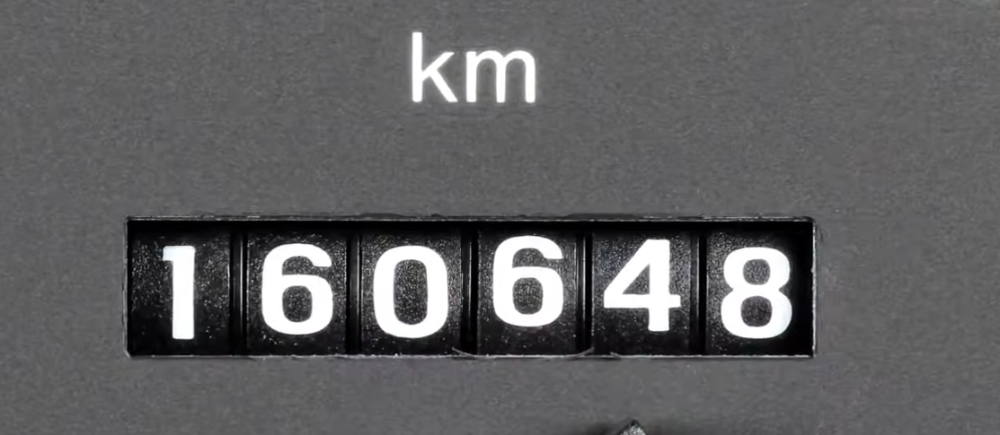
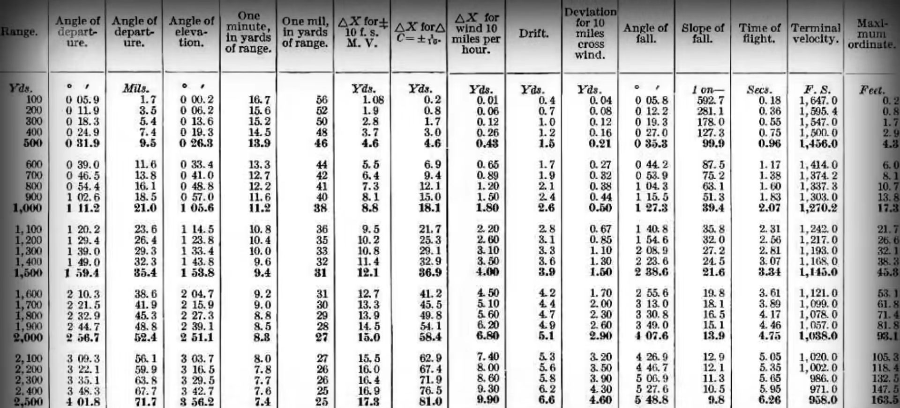

# 1-计算机的早期历史
1. 最早并得到公认的计算设备是 算盘
    * 
2. 在接下来四千年中，人类发明各种计算设备
    * 船只在海上用于计算经纬度: 星盘
    * 帮助计算乘除法: 计算尺
    * 还创造出了上百中时钟(算 日出，潮汐，天体的位置)，或只拿来计时的
    * 这些设备让费力事情变得迅速，简单，精确，降低门槛，提升能力

## 计算机的先驱: **Charles Babbage,曾经说过 随着知识和新工具的增长人类劳工会越来越少**
1. 在后面会讲到，由 计算者 => 计算机 的过程

## 计算机一词 最开始出现的地方
1. 最早开始并不叫做 '计算机'，最早出现 "计算机" 一词是在 1613 年的一本书中
    * 作者为: Richard Braithwait，同时他说了一句话: 计算能力强的人，可以将减少好几天的工作量
> 1800年之前: ”计算机" 代表 计算工作者,1800年之后: ”计算机" 代表 机器
2. "计算机" 一词最开始是指代 "计算者" 也就是 计算的人，(他\她)都会靠自己，并不会去特意使用机器，但是在 1800 年后 "计算机" 一词都是代表 机器了

## 步进计算器
1. 步进计算器最有名的就是: 德国科学家 戈特弗 里德·莱布尼兹 于 1694 年建造
2. 步进计算器就相当于汽车利的里程表，不断累加，有一串可以转动的齿轮，每个齿轮十个齿，代表数组 0 ~ 9
3. 每当一个齿轮转过 9 ，他会转回 0 同时让旁边前进 1 个齿
    * 
4. 做减法的是否，机器会方向运转，利用一些巧妙机械结构，**步进计算器**也可以做乘除法，乘除法就只是多了个加法和减法
    * 17 / 5 => 17 - 5 - 5 - 5 = (17 = 5 * 3 + 2)
5. 同时它也是第一台 可以做 "加减乘除" 四则运算的机器，设计是非常成功的，他的使用长达了 3 个世纪之久
6. 但是有些如果进行一些量大或者复杂的运算那么可能要几个小时或者几天，而且但是这个机器也非常昂贵，很多人都是买计算表，这个表由 "人力计算器" 编撰的，只要到书中查找 1 分钟就可以查找到我们想要的答案

## 军队中很早使用计算器解决问题
1. 因为 要精确炮弹的瞄准问题而炮弹又受到，风力、温度、气压 等影响，要打中巨大的物体也是很困难的
2. 于是军队出表了一个 射程表供应给炮手查看
    * 

## 1991 年历史学家根据 计算机科学的先驱 的草稿做了一个差分机
1. 差分机在建设期间 "Charles Babbage" 构想到一个更复杂的机器-分析机，但是最后没有做成，具体如下:
    * 分析机不想差分机、步进计算器，**分析机是通用计算器**，它可以做很多事情，不只是可做特定运算，甚至可以给数据，然后按顺序执行，它有内存，但是这台机器太过于超前，导致没有被发明出来

## 计算机自动化 代表 跨时代概念预示计算机程序诞生
1. 英国数学家 Ada Lovelace 给分析机做了假象程序，她说未来会诞生一门全新，强大，专门为分析所用的语言，因此 **Ada Lovelace 被认为世界第一位程序员**
2. 分析机激励着第一代计算机科学家，他们将 计算机先驱 的很多点子融入到他们的机器当中
3. 到 19 世纪末，科学领域等特定任务都会使用计算机来完成，但是 政府，公司，家庭还是不常见的
4. 美国政府在 1890 面临一个人口普查的问题，他们宪法规定 10 年进行一次人口普查，这是为了分配联邦资金，国会代表等，到 1880 年，人口迅速增长，大部分因为移民，人口普查要 七年时间来手工编制昨晚都过时了，而且到 1890 年，普查预计要 13 年才可以完成，因此 人口普查局 找到了**Herman Hollerith 发明了打孔卡片制表机**
    * 他的机器结构类似: 莱布尼兹的乘法器，但是使用了电动结构连接其他组件
    * 使用打孔来显示数据，电路驱动电机，普查结婚的 "已婚" 的齿轮 + 1,他的机器速度是 人力的 10 倍之多，给当时政府剩下了 上百万美元
    * Hollerith 成立公司 在 1924年 和其他机械制造商合作后成为 **"国际商业机器公司" 简称 IBM**，改变了商业和政府，到 1900 年代中叶，世界人口爆炸和全球贸易兴起 则需要更快、更灵活的工具来处理数据，为电子计算机 发展奠定基础

---------------------------------------

# 2-电子计算器
1. 在20世纪上半叶，世界人口翻倍增长
    - 一战动员: 七千多万人，二战动员一亿多人
    - 全球贸易和运输更加紧密
    - 工程和科学复杂度也再创新高
    - 甚至那时候考虑登陆其他行星
    
2. 数据增加如何影响计算机的发展
    - 上面所述，人们需要更多自动化，更强大的算力，才可以满足于当时
    - 计算机体型飞速巨化 -> 柜子大小 -> 房间大小
        - 计算机体型变化: 维护费高，易出错
        - 影响: 为未来计算机打下坚持的基础
## 哈佛马克一号
> 哈佛马克一号信息:
- 建造者: IBM
- 建造时间: 1944 年
- 目的: 二战时给同盟国建造
1. 体型,部件:
    - 这台计算机共有 76 万 5 千个组件，300 W 个连接点 和 500 英里(804.65 公里)的导线
        - 英里 -> 公里公式: `英里 * 1.609344` 需要四舍五入
            - `500 * 1.609344 = 804.65` 
        - 公里 -> 英里公式: `公里 * 0.62137`
            - `804.65 * 0.62137 = 500`
2. 为了保持这一台机器的同步运作，内部有 50 英寸的转动轴，有一个 5 马力的点击驱动
3. 最早给 "曼哈顿计划" 跑模拟
    * 曼哈顿计划是 第